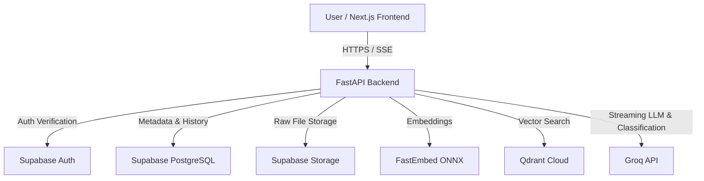

# DocuChat — AI Document Q&A (RAG Application)

A full-stack, production-grade Retrieval-Augmented Generation (RAG) web application that enables users to upload multiple documents (PDF, TXT, CSV, XLSX) and query them interactively with streaming AI responses, citation validation, and conversation management.

---

## Features

- **Document Processing & Ingestion**:
  - Supports PDF, TXT, CSV, and XLSX formats with magic-byte validation.
  - Text extraction, chunking with overlap, and spreadsheet-aware processing.
  - Embeddings generated via FastEmbed (`BAAI/bge-small-en-v1.5`, 384-dimensional).
  - Dense vector indexing and similarity search in Qdrant Cloud.
- **Intelligent Query Pipeline**:
  - **LLM-Driven Intent Classification**: Distinguishes between document queries and casual chitchat (`"Hi"`, `"What can you do?"`), streaming conversational responses directly without wasteful vector searches.
  - **Context-Aware Query Rewriting**: Resolves ambiguous references and pronouns based on conversation history.
  - **Aggregation Detection**: Automatically routes multi-document aggregate queries to include summary chunks.
  - **Token-by-Token Streaming**: Real-time Server-Sent Events (SSE).
  - **Citation Verification**: Highlights verified sources with inline page badges (`[Page X]`) and expandable preview drawers.
- **Modern User Experience**:
  - Built with Next.js (App Router), TypeScript, and Tailwind CSS.
  - Clean dark-mode UI with smooth micro-animations.
  - Real-time Markdown rendering with code blocks and formatted tables.
  - Interactive conversation sidebar with thread deletion and confirmation dialogs.
  - Supabase Authentication (sign up, login, persistent sessions).

---

## Architecture Overview



---

## Tech Stack

### Backend
- **Framework**: FastAPI (Python 3.12, Async)
- **Database**: PostgreSQL (Supabase) via SQLAlchemy + Alembic
- **Vector Database**: Qdrant Cloud
- **Embeddings**: FastEmbed (ONNX runtime)
- **LLM**: Groq Cloud API
- **File Storage & Auth**: Supabase Storage & Supabase Auth

### Frontend
- **Framework**: Next.js 15 (App Router)
- **Language**: TypeScript
- **Styling**: Tailwind CSS, Lucide Icons
- **Markdown**: `react-markdown`, `remark-gfm`
- **Auth Client**: `@supabase/ssr`

---

## Getting Started

### Prerequisites
- Python 3.11+
- Node.js 18+ and npm
- Supabase account (Database, Auth, Storage)
- Qdrant Cloud cluster and API key
- Groq Cloud API key

---

### Backend Setup

1. **Navigate to the backend directory**:
   ```bash
   cd backend
   ```

2. **Create and activate a virtual environment**:
   ```bash
   python -m venv venv
   # Windows:
   venv\Scripts\activate
   # macOS / Linux:
   source venv/bin/activate
   ```

3. **Install dependencies**:
   ```bash
   pip install -r requirements.txt
   ```

4. **Configure environment variables**:
   ```bash
   cp .env.example .env
   ```
   Fill in your Supabase, Qdrant, and Groq credentials in `backend/.env`.

5. **Run database migrations**:
   ```bash
   alembic upgrade head
   ```

6. **Start the backend server**:
   ```bash
   uvicorn app.main:app --reload --host 0.0.0.0 --port 8000
   ```

---

### Frontend Setup

1. **Navigate to the frontend directory**:
   ```bash
   cd frontend
   ```

2. **Install dependencies**:
   ```bash
   npm install
   ```

3. **Configure environment variables**:
   ```bash
   cp .env.example .env.local
   ```
   Set `NEXT_PUBLIC_SUPABASE_URL` and `NEXT_PUBLIC_SUPABASE_ANON_KEY`.

4. **Start the development server**:
   ```bash
   npm run dev
   ```

5. Open [http://localhost:3000](http://localhost:3000) in your browser.

---

## License

MIT License.
